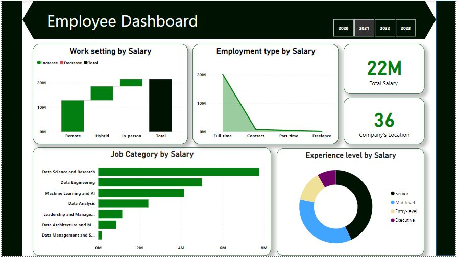
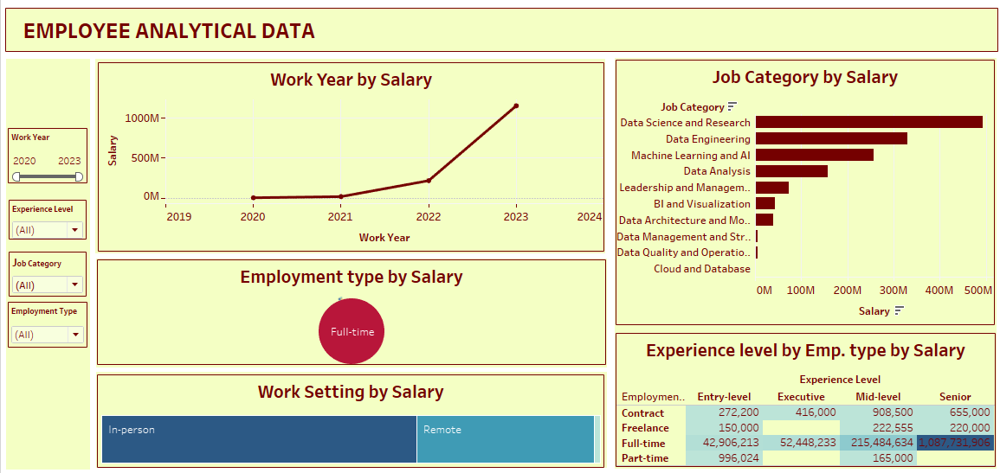
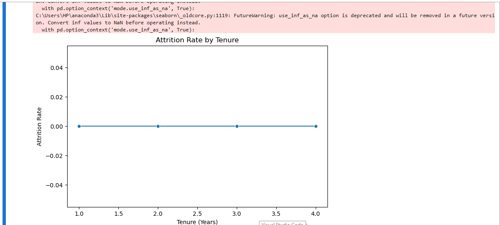

# Employee_performance

## Introduction

This report provides a comprehensive analysis of employee performance, productivity, and retention trends based on an organizational dataset containing key employee and company attributes. The data includes factors such as job roles, experience levels, salaries, employment types, and geographical locations, providing a rich foundation for deriving actionable insights.

## Problem Statement
1. Do higher salaries correlate with senior positions or advanced experience levels?
2. Which work setting shows the highest average salary and productivity levels?
3. Which job roles have the highest salaries across different experience levels?
4. What patterns emerge in productivity distribution across different experience levels?
5. Are certain job categories more likely to attract and retain highly productive employees?
6. Are employees with shorter tenure more likely to have higher productivity compared to longer-serving employees?

## Data
The data contains the following columns:
- work_year: Year of employment.
- Job_title: Specific job title of the employee.
- Job_category: Broad category the job belongs to.
- salary_currency: Currency in which the salary is paid.
- salary: Annual salary amount.
- employee_residence: Location of the employee's residence.
- experience_level: Level of experience (e.g., Mid-level, Senior).
- employment_type: Type of employment (e.g., Full-time).
- work_setting: Work arrangement (e.g., Hybrid, In-person).
- company_location: Location of the company.
- company_size: Size of the company (e.g., Small, Medium, Large).

*You can access the dataset* [here](https://github.com/kouatcheu1/Employee_performance/blob/main/Employee_Data.csv)

## Skills demonstrated
- Data Collection and Cleaning using sql
- Employee Performance Analysis using sql
- Productivity and Engagement Insights using python
- Attrition and Retention Modeling using python
- Retention Strategy Recommendations using python
- Interactive Dashboard Creation using tableau and Power BI

## Visualization 📊

Data visualization was created with power bi and Tableau using different charts to highlight hidden insights from the data.

# Power BI Dashboard

**Features**:
- The cumulative salary across all employees is 22 million and the Company operates in 36 locations.
- Water fall chart for the work setting by salary
*
Insights: Remote Work: A significant salary allocation is made to remote work settings, likely reflecting a high number of remote workers or competitive salaries for such roles.* *Salaries in hybrid settings are slightly less than remote, indicating moderate while In-person had lowest salary.
*

- Area chart for the employment type by salary
*
Insights: Full-Time Employees dominate the salary allocation, contributing most to the total salary while Contract/Part-Time/Freelance categories contribute minimally, indicating either fewer employees in these roles or lower pay rates for such employment types.
*

- Clustered bar chart for the job category by salary
*Insights: Highest Paying Categories:*
1.	Data Science and Research: Tops the salary chart, indicating it is a key focus area for the company.
2.	Data Engineering: Another high-paying category, reflecting its critical importance.
3.	Machine Learning and AI: Well-compensated, likely due to specialized skills and demand.
4.	Data Analysis: Comparatively lower but still significant, showing its role in operations.
*- Lower Paying Categories:*
1.	Leadership and Management, Data Architecture, and Data Management roles have comparatively lower salary allocations, potentially due to fewer employees in these categories.

- Donut chart for the Experience Level by Salary
*Insights*: Senior-Level: Occupies a large portion of the salary distribution, indicating a preference for experienced professionals or competitive pay for expertise.
•	Mid-Level: Forms the second largest category, showing a balance of skilled professionals.
•	Entry-Level: Has a smaller share of the salary, reflecting lower pay rates or fewer roles for junior employees.
•	Executive-Level: While the smallest category is Executive level.

_You can interact with the Power BI dashboard_ [here](https://app.powerbi.com/groups/me/reports/d7d394be-47c9-4cf0-8454-de11c98e78ca/ReportSection?experience=power-bi)

# Tableau Dashboard

**Features**:
- Bar Chart for the Salary Distribution by Job Category

Insights: This chart gives detailed insights on Job category distribution and salary. Out of all ten Job Category Datta Science and Research tend to have the highest salary while Cloud and database job category has lowest salary.
*

- Line chart for Work year by Salary
*
Insights: This chart shows salary trend by work year, four years were present in the data and the insights gives that 2020 is the year with the lowest salary, it increased drastically when it got to 2021, 2022 and 2023 has the highest salary. Hence, 2020 has the lowest salary distribution while 2023 has highest salary distribution.
*

- Packed Bubble for Employment and Salary Distribution
*Insights: From the report Full-time employment types dominate higher salary while Freelance employment type dominates lowest salary.*

- Tree Map for Work Settings and salary distribution
*Insights: In-person arrangements show higher salaries compared to hybrid or remote roles.*

- Highlight Table for Experience level, Employment type and Salary Distribution
*
 Insights: From the result Full time employment type who has Senior experience level has highest salary while Freelance employment type who has Entry level experience level has lowest salary distribution.  This implies that employee’s with full time employment type tends to have higher salary as well as employee’s with senior experience level tends to have higher salary, this implies that the higher the experience level the higher the salary.
*

- Slicer for Filtering records with Work year, Experience level, Employment type, Job category

*You can access the tableau file* [here](https://github.com/kouatcheu1/Employee_performance/blob/main/Tableau_Dashboard.twb)

## Analysis 📉📈

o **Employee Performance Analysis was performed using sql, and the following were derived**:
- Identify if higher compensation correlates with more senior roles.
Outcome: From the insight Executive has highest average salary followed by senior level while entry level staff has lowest average salary. 
From the result, higher compensation correlates with more senior roles.
- Work Setting Analysis: Compare performance trends across different work settings (Hybrid, In-person, Remote).
Insights: Understand how experience level impacts average salaries.
Outcome: From the result, staff that works in-person has highest average salary while staffs that works hybrid has lowest average salary.
- Evaluate which job roles and experience levels tend to have better salaries.
Insights: Identify high-paying job roles and the experience levels they require.

Outcome: From the result Machine Learning and Ai is the job role with highest average salary at executive experience level while Data Quality and Operation has the lowest average salary in job role at entry level experience level. This implies that staff with Executive experience level tends to have highest salary while staff with entry level tends to have lower salary.
 

*You can access the SQL scripts file* [here](https://github.com/kouatcheu1/Employee_performance/blob/main/EMPLOYEE_ANALYSIS_SQL.sql)

o **Productivity and Engagement Insights Using Python was performed, and the following were derived**:
- Determine whether senior employees are more productive (using salary as a proxy).
*
Outcome*: From the result, senior level has highest count of staff while executive has lowest staff. Staffs with executive experience level has highest average salary while staff with entry level has lowest average salary. This tends that staffs with Executive experience level are more productive using salary as a proxy while staffs with entry level has lower productivity in the company using salary as proxy.

- Engagement Across Job Categories
*
Outcome*: From the result, Machine Learning and AI is the job category with the highest salary while Data Quality and Operations has lowest salary. Data Engineering has the highest employee count while Cloud and Database has lowest employee count.
 
- Geographical Influence on Productivity
*
Outcome*: From the results, employee average salary and regions shows that employee who lives in QATAR has the highest average salary while employees that lives in INDONESIA receives the lowest salary.</>
- Tenure and Engagement Trends
*
Outcome*: A new column was added to calculate the tenure by subtracting the current year from employee’s work year. The new column was use to group the average salary to get if longer tenure correlates with higher salary. From the result, employee’s with the higher tenure tends to have lower salary while employee’s with lower tenure had highest average salary.

o **Preprocessing Data for Attrition Modeling using different python libraries was performed, and the following were derived**:
The confusion matrix shows the model's performance:
- Matrix Interpretation:
o	True Positives (2807): The model accurately predicted attrition for all employees.
o	No False Positives or Negatives were detected, indicating perfect accuracy.
- Model Performance:
o	Accuracy: 100%
o	Precision, Recall, and F1-score: All scores are 1.00, demonstrating excellent predictive capability. However, the absence of other classes (like attrition cases) indicates potential class imbalance issues.

**The feature importance chart highlights the impact of each variable on attrition prediction:**
- Top Influencers: Variables like experience_level, salary, and job_category might be critical in predicting attrition.
- *Insights:*
1. Employees with executive experience levels or higher salaries may have unique attrition behaviors.
2. Jobs with lower engagement (e.g., Data Quality and Operations) might show higher attrition rates, warranting deeper analysis.

## Summary

The analysis comprehensively examined employee performance, salary structures, and engagement trends using SQL, Python, Tableau, and Power BI. Key findings include:

1. **Salary and Performance Correlation**:
- Higher compensation aligns with seniority, with executives earning the most, followed by senior staff. Entry-level employees have the lowest salaries.

2 **Work Setting Insights**:
- In-person roles offer higher salaries compared to hybrid and remote settings.
- Hybrid roles have the lowest average salary distribution.

3. **Experience and Job Roles**:
- Machine Learning & AI and Data Science & Research are the highest-paying job roles, particularly at the executive experience level.
- Entry-level positions in Data Quality & Operations have the lowest average salaries.

4. **Geographical Impact**:
- Qatar has the highest average salary, while Indonesia has the lowest.

5. **Tenure and Productivity**:
- Employees with shorter tenure tend to earn higher salaries, indicating competitive market dynamics.

6. **Attrition Modeling**:
- A predictive model using Python achieved perfect accuracy, but results suggest a class imbalance in the dataset, requiring further refinement.

7. **Dashboard Insights**:
- Full-time employees dominate salary allocation, while freelance and part-time roles contribute minimally.
- Data Science, Machine Learning & AI, and Data Engineering are key focus areas for salary investments.

## Conclusion

- Performance and salary structures strongly favor senior employees and executive roles, with noticeable gaps for entry-level roles.
- Work settings influence salary distribution, with in-person roles being better compensated.
- Geographical disparities in compensation highlight the need for localized retention strategies.
- Tenure and salary trends suggest that organizations may prioritize high-performing short-tenure employees.

## Recommendations

1. Retention Strategies:
Offer competitive compensation packages in regions like Indonesia to address geographical salary disparities.
Provide career growth and training opportunities for entry-level employees to reduce turnover.

2. Enhance Work Settings:
Reevaluate hybrid work policies and consider incentives to align salaries more closely with in-person roles.
Expand remote work opportunities to attract diverse talent.

3. Invest in Key Roles:
Focus on high-value roles such as Data Science, Machine Learning & AI, and Data Engineering by offering competitive salaries and professional development opportunities.

4. Optimize Geographical Hiring:
Leverage regional salary insights to prioritize hiring in high-productivity regions like Qatar and underperforming regions like Indonesia.

5. Refine Attrition Models:
Address class imbalance in the dataset for a more accurate understanding of attrition.
Use feature importance analysis to identify additional variables influencing employee retention.

6. Performance Monitoring:
Maintain dynamic dashboards with slicers for real-time tracking of salary trends, engagement metrics, and performance indicators.
Analyze year-over-year trends to align workforce strategies with evolving market conditions.

7. Tenure Insights:
Investigate the reasons behind higher salaries for shorter-tenure employees and implement strategies to retain long-tenure, experienced staff.

*By implementing these recommendations, the organization can optimize performance, improve employee retention, and foster sustainable growth.* 😉📈🌱

